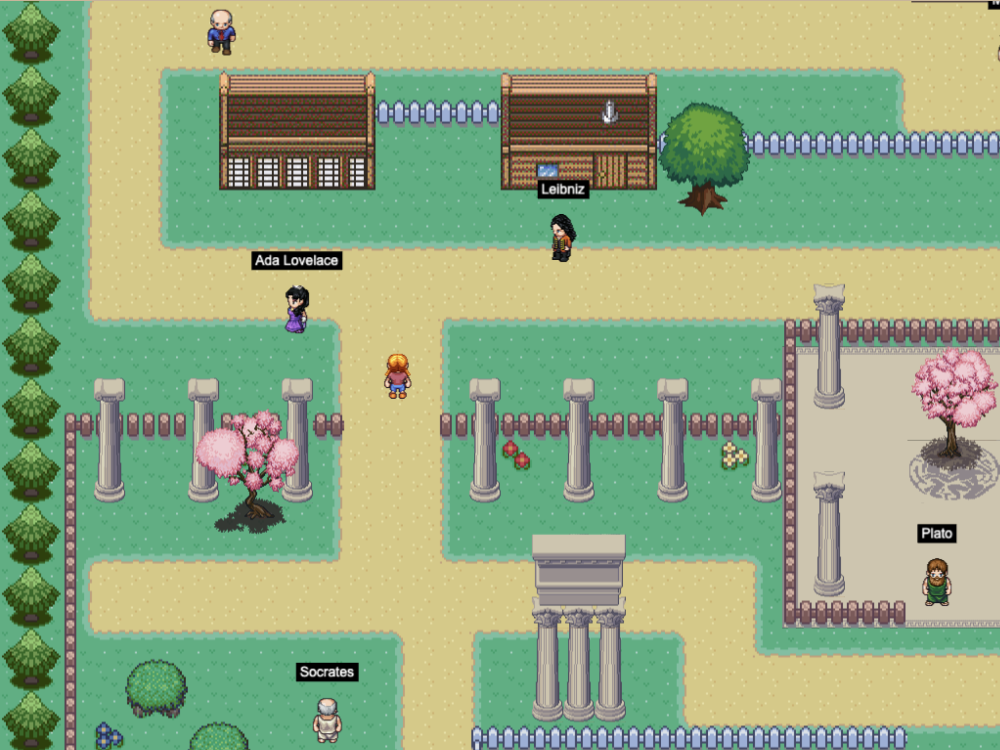
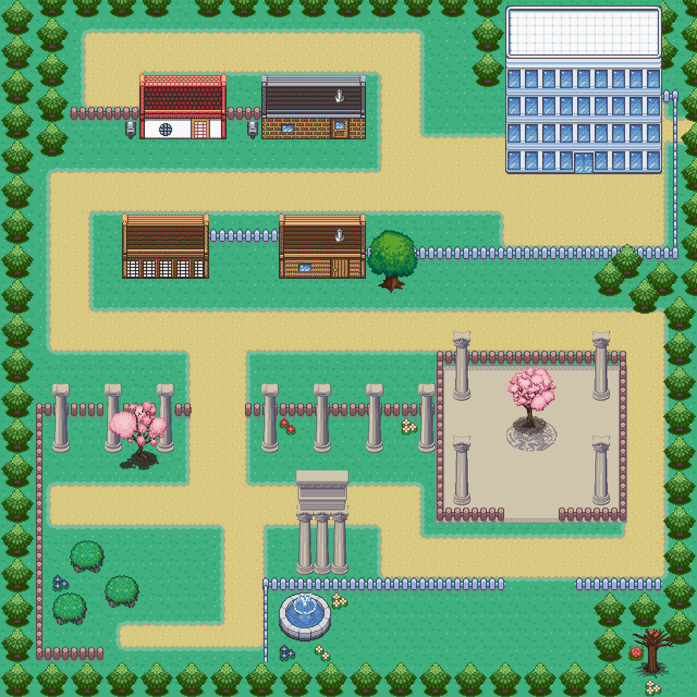
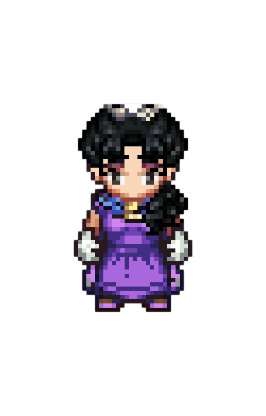

# PhiloAgents Town 📖



PhiloAgents Town is the interactive UI component that allows you to engage in philosophical discussions with the Philosopher Agents. Discuss consciousness with Descartes, question Leibniz on logic, or challengue Chomsky on language. 

# Overview

This web-based game features a Pokemon-style town where you can explore and engage with famous philosophers and thinkers. Each character has their own unique perspective and conversational style based on their works and ideas.

The UI is built with Phaser 3, a powerful HTML5 game framework, and connects to a backend API that powers the philosopher agents' conversational abilities using LLM Agents.


# Getting Started

## Requirements

[Node.js](https://nodejs.org) is required to install dependencies and run scripts via `npm`. If you don't want to install Node.js, you can use the Docker container. 

## Available Commands

| Command | Description |
|---------|-------------|
| `npm install` | Install project dependencies |
| `npm run dev` | Launch a development web server |
| `npm run build` | Create a production build in the `dist` folder |
| `npm run dev-nolog` | Launch a development web server without sending anonymous data (see "About log.js" below) |
| `npm run build-nolog` | Create a production build in the `dist` folder without sending anonymous data (see "About log.js" below) |

## Setting up the UI

After cloning the repo, run npm install from your project directory. Then, you can start the local development server by running npm run dev.

```bash
git clone https://github.com/neural-maze/philoagents.git
cd philoagents/ui
npm install
npm run dev
```

The local development server runs on http://localhost:8080 by default.


# Features

## Interactive Town Environment

Explore a charming pixel-art town with various buildings and natural elements.



To build the town, we have used the following assets:

- [Tuxemon](https://github.com/Tuxemon/Tuxemon)
- [LPC Plant Repack](https://opengameart.org/content/lpc-plant-repack) 
- [LPC Compatible Ancient Greek Architecture](https://opengameart.org/content/lpc-compatible-ancient-greek-architecture)

## Philosophical Characters

Interact with famous philosophers like Socrates, Aristotle, Plato, and AI thinkers like Turing and Chomsky.
Every character sprite has been built with the [Universal LPC Spritesheet Generator](https://liberatedpixelcup.github.io/Universal-LPC-Spritesheet-Character-Generator/#?body=Body_color_light&head=Human_m)




## Dialogue System

Engage in conversations with philosophers to learn about their ideas and perspectives. The dialogue system is controlled by the [DialogueBox](https://github.com/neural-maze/philoagents/blob/main/ui/src/scenes/DialogueBox.js) and [DialogueManager](https://github.com/neural-maze/philoagents/blob/main/ui/src/scenes/DialogueManager.js) classes.

## Dynamic Movement

Characters roam around the town with realistic movement patterns and collision detection. This is implemented in the [Character](https://github.com/neural-maze/philoagents/blob/main/ui/src/objects/Character.js) class, where you'll find the logic for the NPCs to move around the town.


# Project Structure

We have provided a default project structure to get you started. This is as follows:

- `index.html` - A basic HTML page to contain the game.
- `src` - Contains the game source code.
- `src/main.js` - The main entry point. This contains the game configuration and starts the game.
- `src/scenes/` - The Phaser Scenes are in this folder.
- `public/style.css` - Some simple CSS rules to help with page layout.
- `public/assets` - Contains the static assets used by the game.

# Docker 

The project includes Docker support for easy deployment. You can use the following commands to run the UI with Docker:

```bash
# Build the Docker image
docker build -t philoagents-ui .

# Run the container
docker run -p 8080:8080 philoagents-ui
```

This is great if you want to debug, but you need to understand that this is just the UI and you need to have the backend running to have a complete experience. That's why we have provided a Docker Compose file (parent directory) that will start the UI and the backend together.

# Controls

- Arrow keys: Move your character around the town
- Space: Interact with philosophers when you're close to them
- ESC: Close dialogue windows or open the pause menu

# Contributing

Contributions are welcome! Please feel free to submit a Pull Request.
